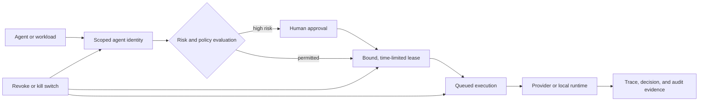

# NeuralOps

**Stop unsafe AI-agent actions before they execute.** NeuralOps gives an agent a scoped identity, asks for approval when risk is high, issues a short-lived authorization lease for the exact action, and records the resulting evidence. An owner, admin, or security operator can revoke access or activate a kill switch when conditions change.

It is an open-source control plane for teams building agents, LLM workflows, RAG applications, and OpenAI-compatible gateway integrations. It includes a React operator console and a FastAPI API; the repository root package is intentionally private and no SDK package is published from this repository.


## Quick start

Requirements: Docker Desktop with Docker Compose.

```powershell
git clone https://github.com/Gowrav-M/neuralops-platform.git
cd neuralops-platform
docker compose up --build
```

Open http://localhost:5173. The API is available only on http://localhost:8000 and stores local SQLite data in a Docker named volume. This local stack disables authentication and outbound connector/GitHub delivery, uses no provider keys, and is for evaluation rather than public deployment. Press `Ctrl+C` to stop it; use `docker compose down` to remove containers while retaining the local database volume.

### Native development alternative

Requirements: Node.js 20.19+ or 22.12+, and Python 3.12+.

```powershell
npm install
python -m pip install -r backend/requirements.txt
$api = Start-Process -FilePath python -ArgumentList @('-m', 'uvicorn', 'app.main:app', '--app-dir', 'backend', '--reload', '--host', '127.0.0.1', '--port', '8000') -PassThru; npm run dev
```

Open http://localhost:5173. The last command starts the API in the background and Vite in the foreground. Press `Ctrl+C` to stop Vite; then run `Stop-Process -Id $api.Id` in that PowerShell session to stop the API.

Local development uses SQLite by default and includes a deterministic local agent runtime, so provider credentials are not required to explore the control flow. Copy `.env.example` to `.env` only when you need to configure auth, a database, or a live provider. Do not commit it.

## The control loop



For queued agent runs, execution checks the identity again, validates its environment, permissions, provider access, production-access state, and an active lease bound to the action context, content hash, provider, model, and environment. A lease is consumed atomically. Revocation and the kill switch revoke active leases and cancel affected jobs; completion uses a compare-and-set transition so a cancelled job is not revived by stale output.

These controls reduce risk; they are not a substitute for threat modeling, provider controls, sandboxing, review of policy rules, or operating procedures appropriate to your environment.

## Supported workflows

- Register scoped agent identities with explicit permissions, provider access, environment, and production-access status.
- Request, approve, block, revoke, validate, and consume authorization leases. High-risk actions require explicit approval; approvers cannot approve their own request when authenticated workspace controls are enabled.
- Run local or configured live agent workflows through direct execution or the queued worker API, retaining run, trace, decision, and audit records.
- Ingest traces through REST, batch ingestion, OpenTelemetry normalization, or the repository's JavaScript/Python client source.
- Run release gates, replay stored traces, inspect evidence, and export evidence packs for review.
- Route OpenAI-compatible traffic through configured providers, with policy checks, routing, trace evidence, and `not_configured`/failure behavior when a provider is unavailable.

The included local runtime is deterministic and deliberately limited. Live provider behavior depends on credentials and provider availability; `providerMode: live` returns an error when no configured provider succeeds rather than generating a synthetic answer.

## Privacy and security model

- The default local store is SQLite. A server-side Postgres/Supabase configuration is supported for deployed environments; enable authentication and apply/review the supplied migrations before treating it as a multi-user deployment.
- API and agent credentials are stored as hashes where the implementation supports it; one-time credentials should be captured only by the intended operator and then rotated if exposed.
- With authentication enabled, workspace identity is derived from trusted JWT claims and records are scoped to that workspace. Verify your own identity-provider configuration and row-level-security policy before deployment.
- Evidence may contain operational metadata and, depending on your configuration and workload, prompts or outputs. Set retention deliberately, minimize sensitive input, restrict access, and use the data-governance/hold flows before destructive retention actions.
- External connector delivery is disabled unless its corresponding server-side flag is explicitly enabled. Provider credentials belong in server-side environment configuration, never browser variables or commits.

See [SECURITY.md](SECURITY.md) for vulnerability reporting and [docs/production-readiness.md](docs/production-readiness.md) for the existing deployment-readiness material.

## Deployment modes

| Mode | Intended use | Notes |
| --- | --- | --- |
| Local | Evaluation and development | SQLite, local runtime, and auth disabled by default. |
| Self-hosted | Your controlled infrastructure | Configure a server-side database, CORS, authentication, secret management, backups, and monitoring. |
| Render blueprint | Low-cost preview/testing | `render.yaml` selects a free plan. After idle time, free services can cold-start; callers should tolerate readiness delays and retries. It is not an availability or latency guarantee. |

The frontend can be deployed as a static Vite build (`npm run build`). The API exposes `/health` and `/ready`; use `/ready` for readiness checks. Do not expose a deployment publicly until authentication, database isolation, CORS, and secrets have been configured and tested for your environment.

## Verification

The CI workflows use the following checks. Run the relevant set before opening a pull request:

```powershell
npm ci
python -m pip install -r backend/requirements.txt
npm run lint
npm audit --audit-level=high
npm run test:sdk
npm run test:deployment
npm run build
python -m pytest backend
npx playwright install --with-deps chromium
npm run test:e2e
npm run test:e2e:landing
```

The Linux CI workflow uses `npx playwright install --with-deps chromium`. On Windows, use `npx playwright install chromium` instead because Playwright does not support `--with-deps` there. The release-gate workflow also starts a local API, seeds bounded test evidence, and runs the CLI release gate. Passing these checks demonstrates only the checked behavior; it does not certify a deployment, provider, or security posture.

## Repository guide

- `backend/` — FastAPI API, persistence, authorization, runtime, and tests.
- `src/` — React operator console.
- `sdk/` — JavaScript and Python client source used by repository tests; neither is published as a package by this project.
- `supabase/migrations/` — optional Postgres/Supabase schema and RLS migrations.
- `docs/` — workflow and operational documentation.
- `.github/workflows/` — CI, release-gate, and image/deployment workflow definitions.

## Contributing and support

Read [CONTRIBUTING.md](CONTRIBUTING.md) before proposing changes. Please use [GitHub Issues](https://github.com/Gowrav-M/neuralops-platform/issues) for reproducible bugs and feature proposals; see [SUPPORT.md](SUPPORT.md) for scope and [CODE_OF_CONDUCT.md](CODE_OF_CONDUCT.md) for community expectations. Report security vulnerabilities privately as described in [SECURITY.md](SECURITY.md).

The planned direction is in [ROADMAP.md](ROADMAP.md). Changes are recorded in [CHANGELOG.md](CHANGELOG.md).

## License

Licensed under the [Apache License 2.0](LICENSE). See [NOTICE](NOTICE) for attribution.
