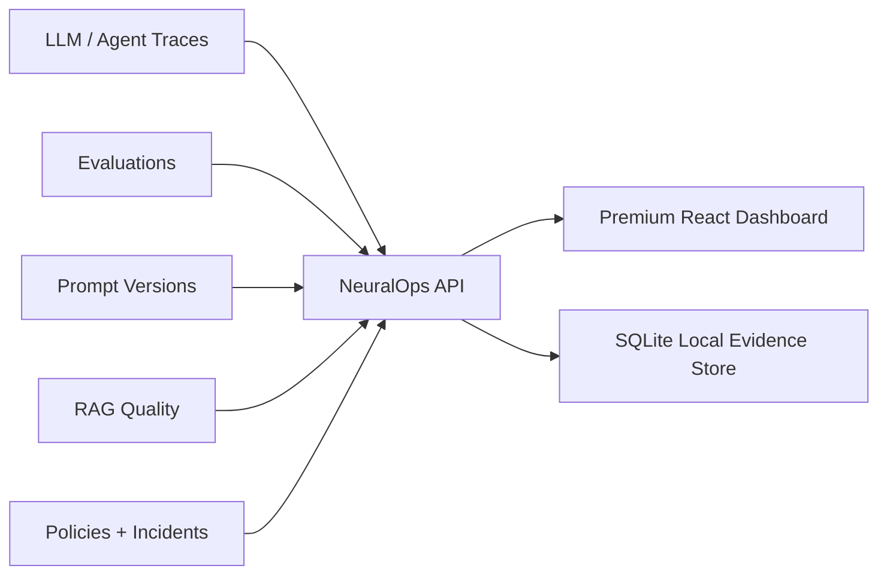

# NeuralOps Platform

Production-style AI control plane for LLM apps, RAG systems, agents, cost, evaluations, prompts, and policy guardrails.

The frontend keeps the premium warm enterprise dashboard direction from the original `D:\SAAS` build, while this repo adds a real FastAPI + SQLite backend that owns the primary product data.


## What It Solves

AI teams ship many models, prompts, RAG flows, and agents, but production failures usually appear across multiple layers: latency, cost spikes, bad evals, tool misuse, policy violations, and incident response. NeuralOps puts those signals into one operational cockpit.



## Run Locally

Install frontend dependencies:

```powershell
cmd /c npm install
```

Install backend dependencies:

```powershell
python -m pip install -r backend\requirements.txt
```

Start the backend:

```powershell
cmd /c npm run dev:api
```

Start the frontend in another terminal:

```powershell
cmd /c npm run dev
```

Open `http://localhost:5173`.

## API Surface

- `GET /health`
- `GET /api/dashboard`
- `GET /api/traces`
- `GET /api/traces/{trace_id}`
- `POST /api/traces/simulate`
- `GET /api/incidents`
- `PATCH /api/incidents/{incident_id}`
- `GET /api/prompts`
- `POST /api/prompts/{prompt_id}/deploy`
- `GET /api/evals`
- `POST /api/evals/run`
- `GET /api/rag`
- `GET /api/costs`
- `POST /api/costs/simulate-anomaly`
- `GET /api/policies`
- `POST /api/policies/test`
- `GET /api/agents`
- `GET /api/settings`

## Verification

```powershell
cmd /c npm run lint
cmd /c npm run build
python -m pytest backend
```

## Product Roadmap

- Replace seed data with authenticated workspace data.
- Add Postgres migrations for production deployment.
- Add OpenTelemetry trace ingestion.
- Add prompt/eval release workflow.
- Add provider integrations for OpenAI-compatible endpoints and NVIDIA NIM.
- Add CI gate for policy and eval regression checks.
