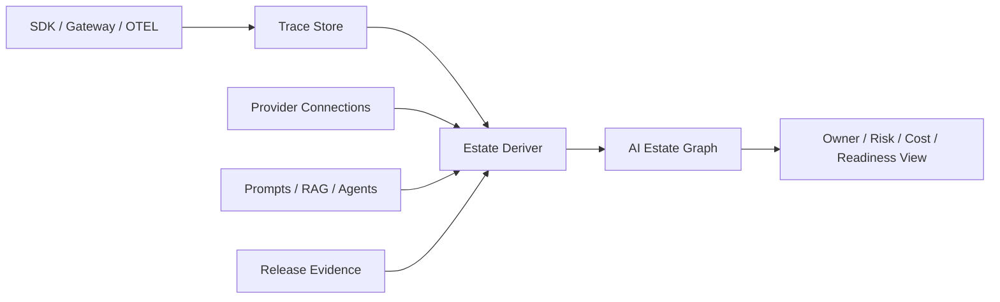

# AI Estate Graph

NeuralOps Estate is the governance registry for AI systems observed by the platform.

It answers four operator questions:

- What AI systems exist in this workspace?
- Which providers, models, prompts, datasets, policies, and evidence records do they touch?
- Who owns each system?
- Which systems need review before production changes?

## Discovery Sources

Estate records are derived from persisted backend evidence:

- `traces`: app/service identity, environment, model, provider, latency, cost, score, and risk flags
- `gateway_route_events`: gateway strategy, selected provider, cache status, budget decision, and route outcome
- `provider_connections`: configured provider/model routes and readiness state
- `agent_runs`: agent identity, model, decision, policy findings, and trace links
- `prompts`: prompt versions, owner metadata, canary/production status, and eval scores
- `rag`: retrieval quality records and dataset/chunk evidence
- `release_gates`: release readiness evidence linked back to discovered systems

If no records exist, Estate stays empty and points the user to Connect or Gateway. This is intentional.

## APIs

```text
GET   /api/estate/summary
GET   /api/estate/systems
GET   /api/estate/systems/{system_id}
GET   /api/estate/graph
PATCH /api/estate/systems/{system_id}
POST  /api/estate/rebuild
```

Only editable governance metadata can be patched:

- `name`
- `owner`
- `tags`

Operational fields such as risk, cost, latency, eval score, and latest trace are recomputed from backend records.

## Graph Model

Systems can be:

- `app`
- `agent`
- `gateway`
- `provider`
- `model`
- `prompt`
- `dataset`
- `policy`
- `evidence`

Edges can be:

- `calls`
- `routes_to`
- `uses`
- `evaluated_by`
- `guarded_by`
- `released_by`
- `observed_as`
- `owns`

## Workflow

1. Connect an app through the SDK, REST ingest, OTEL ingest, or Gateway.
2. Open Estate and inspect discovered systems.
3. Assign an owner and tags.
4. Run release gates or replay gates.
5. Rebuild Estate to persist an auditable snapshot.


